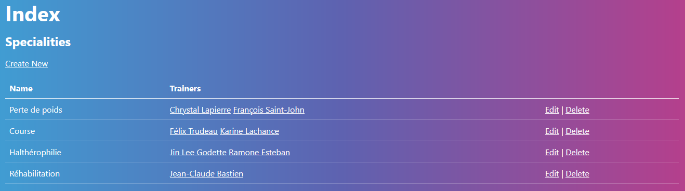
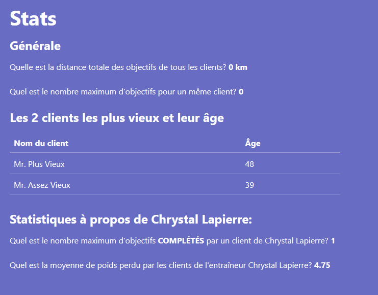

# TP1

import CodeBlock from '@theme/CodeBlock';
import CommentCommitPush from '/comment-commit-push.mdx';

## Consignes (20% de la note finale)

- Lisez toutes les instructions et la grille de correction avant de commencer
- Créez un Repository `PRIVÉ` et ajoutez votre enseignant comme collaborateur
:::danger
N'oubliez pas de choisir l'option **VisualStudio** pour **.gitignore**
:::
- Vous **DEVEZ** faire au moins les migrations et les commits demandés, mais vous pouvez en faire plus sans problème, tant que vous les documentez correctement

## Étude de cas JuliePro

> Julie Loiselle est propriétaire de l’entreprise d’entrainement personnel JuliePro. L’entreprise emploi une douzaine d’entraîneurs (**Trainer**) chevronnés et spécialisés (**Speciality** : perte de poids, althérophilie, course, réabilitation, etc).
> Un **Trainer** a une seule **Speciality**.
> Chaque client (**Customer**) est assigné à un **Trainer**.
> Le **Trainer** définit également avec son client un objectif courant (**Objective**) : soit de perte de poids ou de distance. Lorsqu’un **Objective** est atteint, on indique la date.

## Les fonctionnalités à implémenter

- Gestion des spécialités (**Speciality**) avec seed🌱
- Gestion des entraîneurs (**Trainer**) et de leur spécialité (**Speciality**) avec seed🌱
- Ajout à l'index de spécialités
- Implémentation des règles d'affaire spécifiques
- Utilisation de **vues partielles**
- Utilisation de **FontAwesome**
- Mise en place du modèle de donnée pour les clients (**Customer**) et de leurs objectifs (**Objective**) avec seed🌱
- Vue de statistiques
- Vue des objectifs des entraîneurs

## Création du projet

1. Créez le Repository `PRIVÉ` **3W6_TP_NOM_PRENOM** dans GitHub et ajoutez votre enseignant comme collaborateur

2. Créez un nouveau projet MVC qui se nomme **JuliePro**
3. Dans le projet MVC:

- Il faut télécharger ce [fichier zip](/tps/tp1/TP1_FichiersComplementaires.zip) qui contient les images utilisées dans le projet et extraire son contenu dans le répertoire **/wwwroot/** de votre projet

:::tip

Dites oui pour remplacer les fichiers **bootstrap.css** et **bootstrap.min.css** (Bootstrap **5.1.0** contient un bug, alors on utilise la version **5.1.1**)

:::

- Remplacez le contenu du fichier de Layout par ce qui suit:

import LayoutSource from '!!raw-loader!./../../static/tps/tp1/\_Layout.cshtml';

<details>
<summary>/Views/Shared/_Layout.cshtml</summary>
<p>
<CodeBlock language="html" title="_Layout.cshtml">{LayoutSource}</CodeBlock>
</p>
</details>

- Remplacez le contenu du fichier d'Index par ce qui suit:

import IndexSource from '!!raw-loader!./../../static/tps/tp1/Index.cshtml';

<details>
<summary>/Views/Home/Index.cshtml</summary>
<p>
<CodeBlock language="html" title="Index.cshtml">{IndexSource}</CodeBlock>
</p>
</details>

- Finalement, **ajoutez** ceci **à la fin** du fichier wwwroot/css/site.css
:::warning
Il faut ajouter à la fin et non remplacer tout le contenu pour ce fichier
:::

<details>
<summary>/wwwroot/css/site.css</summary>
```
:root {
    --bs-primary: #fc9032;
    --bs-primary-rgb: 232,144,50
}

body {
    background-image: none
}
```
</details>

- Assurez-vous que la page d'accueil de votre application est identique à celle-ci:


<CommentCommitPush/>

## Gestion des spécialités

1. Ajout de la classe **Speciality** qui sera gérer par Entity Framework (**EF**) dans le répertoire **/Models/**


```csharp title="Speciality"
public string Name { get; set; }
```

:::info

Il faut ajouter les champs nécessaires pour Entity Framework (**EF**) et les annotations. Référez-vous au diagramme plus haut qui vous montre les champs de la classe **Speciality**.

:::

2. Génération du contrôleur MVC pour la classe **Speciality**
3. Ajouter un seed🌱 pour les spécialités

```csharp title="Seed des spécialités"
builder.Entity<Speciality>().HasData(new Speciality() { Id = 1, Name = "Perte de poids" });
builder.Entity<Speciality>().HasData(new Speciality() { Id = 2, Name = "Course" });
builder.Entity<Speciality>().HasData(new Speciality() { Id = 3, Name = "Halthérophilie" });
builder.Entity<Speciality>().HasData(new Speciality() { Id = 4, Name = "Réhabilitation" });
```

4. Ajoutez une migration et mettez à jour votre base de données
5. Le menu **Specialities** de la page principale doit nous diriger vers la gestion des spécialités
6. Prenez un moment pour retirer la vue **Details** et retirer le lien dans la vue **Index**
7. À ce point, vous devez pouvoir faire les actions **CRUD** de **Speciality**

<CommentCommitPush/>

## Gestion des entraîneurs

1. Ajout de la classe **Trainer** qui sera gérer par Entity Framework Core dans le répertoire **/Models/**


```csharp title="Trainer"
public string FirstName { get; set; }
public string LastName { get; set; }
public string Email { get; set; }
public string Photo { get; set; }
```

:::info

Il faut ajouter les champs nécessaires pour les **relations** et les **annotations**.

:::

2. Génération du contrôleur MVC pour la classe **Trainer**
3. Ajouter un seed🌱 pour les entraîneurs

```csharp title="Seed des entraîneurs"
builder.Entity<Trainer>().HasData(new Trainer() { Id = 1, FirstName = "Chrystal", LastName = "Lapierre", Email = "Chrystal.lapierre@juliepro.ca", SpecialityId= 1, Photo = "Chrystal.png"});
builder.Entity<Trainer>().HasData(new Trainer() { Id = 2, FirstName = "Félix", LastName = "Trudeau", Email = "Felix.trudeau@juliePro.ca", SpecialityId = 2, Photo = "Felix.png" });
builder.Entity<Trainer>().HasData(new Trainer() { Id = 3, FirstName = "François", LastName = "Saint-John", Email = "Frank.StJohn@juliepro.ca", SpecialityId = 1, Photo = "Francois.png" });
builder.Entity<Trainer>().HasData(new Trainer() { Id = 4, FirstName = "Jean-Claude", LastName = "Bastien", Email = "JC.Bastien@juliepro.ca", SpecialityId = 4, Photo = "JeanClaude.png" });
builder.Entity<Trainer>().HasData(new Trainer() { Id = 5, FirstName = "Jin Lee", LastName = "Godette", Email = "JinLee.godette@juliepro.ca", SpecialityId = 3, Photo = "Jin Lee.png" });
builder.Entity<Trainer>().HasData(new Trainer() { Id = 6, FirstName = "Karine", LastName = "Lachance", Email = "Karine.Lachance@juliepro.ca", SpecialityId = 2, Photo = "Karine.png" });
builder.Entity<Trainer>().HasData(new Trainer() { Id = 7, FirstName = "Ramone", LastName = "Esteban", Email = "Ramone.Esteban@juliepro.ca", SpecialityId = 3, Photo = "Ramone.png" });
```

5. Ajoutez une migration et mettez à jour votre base de données
6. Le menu **Trainers** de la page principale doit nous diriger vers la gestion des entraîneurs

7. Modification de la vue et ajout des entraîneurs
   - Dans la vue Index:
     - Triez les entraîneurs par FirstName en premier et par LastName ensuite
     - Affichez l'image de la photo de l'entraîneur si elle est présente et limitez sa largeur à 200 pixels
     - Affichez le nom de la spécialité, pas son id
   - Dans la vue Details:
     - Affichez l'image de la photo de l'entraîneur en pleine résolution si elle est présente
     - Affichez le nom de la spécialité, pas son id
   - Dans la vue Delete:
     - Affichez le nom de la spécialité, pas son id
   - Dans les vues Create et Edit:
     - Votre select de spécialité est-il vraiment laid?🤮 Rappelez-vous que l'on utilise bootstrap et que les différents éléments doivent utiliser les classes bootstraps!
     - Permettre de sélectionner une spécialité et affichez le nom des spécialités et non pas leurs ids
     - Pour la photo, on garde ça simple pour l'instant et on doit taper le nom de l'image de l'entraîneur

<CommentCommitPush/>

## Ajout à l'index de spécialités

1. Ajouter une colonne qui affiche les **Trainers** des spécialités
2. Chaque **Trainer** doit être un lien vers la page **Edit** de ce **Trainer**



<CommentCommitPush/>

## Implémentation de la logique d'affaire

1. Empêchez d’effacer une **Speciality** si elle est associé à au moins un **Trainer** et affichez un message approprié à l'utilisateur dans ce cas


2. Assurez-vous que le delete d'une **spécialité** fonctionne correctement si elle n'est pas utilisée
3. Assurez-vous que le delete d'un **entraîneur** fonctionne correctement

<CommentCommitPush/>

## Utilisation des vues partielles et de FontAwesome

1. Utilisez une vue partielle pour regrouper le bouton d'**action** et le bouton de **retour vers la liste**. Utilisez une vue partielle pour les boutons d'actions des vues suivantes:
   - Trainers/Create
   - Trainers/Edit
   - Trainers/Delete
   - Specialities/Create
   - Specialities/Edit
   - Specialities/Delete

:::caution

Chaque action peut avoir sa propre vue partielle et c'est aussi possible que 2 actions partagent une même vue partielle. Au total, vous ne devrez donc pas avoir plus de 3 vue partielles différentes pour cette section, car il existe 3 actions (Create, Edit et Delete) et vous **DEVEZ** réutiliser vos vues partielles entre **Trainer** et **Speciality**

:::

2. Maintenant que vos boutons d'actions sont réutilisés dans vos différentes vues, utilisez FontAwesome pour les boutons suivants:
   -  pour Create
   -  pour Save
   -  pour Delete
   -  pour Back to List
3. Si vos boutons sont trop près des autres champs, donnez leur un peu d'espace!


❌


👌

<CommentCommitPush/>

## Ajout de clients et de leurs objectifs

1. Mettez en place le modèle de donnée pour les clients (**Customer**) et leurs objectifs (**Objective**)


```csharp title="Customer"
public string FirstName { get; set; }
public string LastName { get; set; }
public string Email { get; set; }
public DateTime BirthDate { get; set; }
public double StartWeight { get; set; }
```


```csharp title="Objective"
public string Name { get; set; }
public double LostWeightKg { get; set; }
public double DistanceKm { get; set; }
public DateTime AchievedDate { get; set; }
```

2. Un **Customer** a donc une relation **un à plusieurs** avec ses **Objective**. La seule chose qui différencie l'objectif courant, c'est qu'il n'a pas d'**AchievedDate**.
3. Ajouter un seed 🌱 avec 3 clients (**Customer**) et leurs objectifs (**Objective**).
   - Les 3 premier clients doivent être associé à l'entraîneur: **Chrystal Lapierre**
   - Le 4e client doit être associé à l'entraîneur: **Félix Trudeau**
   - Un objectif est considéré comme **courant** si il n'a pas d'AchievedDate et comme **complété** si il en a un.
   - Le premier client doit avoir un objectif **courant** et **trois** objectifs **complété**.
   - Le deuxième client doit avoir **deux** objectifs **courants**.
   - Le troisième client doit avoir **deux** objectifs **complétés**.
   - Le quatrième client doit avoir un objectif **courant** et un objectif **complété**.
   - Le contenu exacte des objectif n'est pas important, mais ils doivent tous être différents et ils doivent contenir un mélange de courses et de perte de poids.
4. Une fois que c'est fait, vérifiez les données dans votre base de données!

<CommentCommitPush/>

## Ajout d'une page de statistiques

1. Créer une page pour afficher des statistiques à propos de l'application.
2. Il faut ajouter **Stats** dans le menu de navigation pour pouvoir accéder à la page de statistiques.
3. Il faut utiliser un **ViewModel** pour contenir les informations à afficher dans cette vue, nommez-le simplement **StatsVM**.
4. Il faut utiliser **Linq** pour obtenir les stats. Chaque stat va demander l'utilisation d'au moins une méthode de Linq qui est spécifiée dans les instructions.
5. Voici les stats qu'il faut afficher
- La distance totale des objectifs avec une Distance (En utilisant **Sum** de Linq)
- Le nombre d'objectifs le plus élevé d'un même client (En utilisant **Max** de Linq)
- Une très courte liste avec les deux clients les plus vieux en ordre décroissant. Il faut afficher leurs noms et leurs âges. (En utilisant **OrderBy** et **Take** de Linq)
- Les deux stats suivantes sont seulement pour l'entraîneur Chrystal Lapierre
  - La perte de poids moyenne de ses clients (Moyenne par client, pas par objectif en utilisant **Average** et **Sum** de Linq) 
  - Le nombre maximal d'objectifs complétés par un de ses clients (En utilisant **Max** de Linq)
6. Voici une référence pour comprendre ce que l'application doit afficher. (Les valeurs ne sont **pas** les bonnes, évidemment)

<details>

</details>

:::info
Vous pouvez faire cette page en français ou en anglais.
:::

<CommentCommitPush/>

## Affichage d'un menu d'objectifs

1. C'est maintenant le moment de travailler sur la dernière fonctionnalitée, l'affichage des objectifs.
2. Il faut ajouter une nouvelle option qui doit se nommer **Objectives** dans le menu de navigation pour pouvoir accéder à la page d'objectifs.
3. Voici ce que l'on doit voir dans ce menu lorsque l'on clique sur **Chrystal Lapierre**:


4. Et lorsque l'on clique sur **Félix Trudeau**:


5. Pour le menu précédent vous devrez utiliser un **accordion** de bootstrap pour afficher chacun des entraîneurs.
6. Une fois que vous affichez le contenu pour un entraîneur, utilisez simplement un tableau.
7. Pour ce menu, vous **devez** utiliser au une vue partielle pour affichez le tableau et vous **devez** également utiliser une vue partielle pour afficher le contenu de chaque rangé du tableau.
8. Vous **devez** également utiliser un ViewModel qui doit se nommer **TrainerObjectivesVM**.
9. Vous **devez** également créer un ViewModel qui doit se nommer **CustomerObjectivesVM**.
10. Le ViewModel **TrainerObjectivesVM** **doit**, en plus de ses autres propriétés, contenir un IEnumerable\<CustomerObjectivesVM\>.

11. Vous pouvez nommer vos vues comme vous le voulez, mais voici une suggestion:
   - Vue principale avec l'accordéon (**accordion**) (AllObjectives.cshtml)
     - Vue partielle avec le tableau (TrainerObjectives.cshtml)
       - Vue partielle avec une rangé du tableau (CustomerObjectives.cshtml)
12. Remarquez que pour chaque titre de l'**accordion** on affiche le nom de l'entraîneur **ET sa spécialité**.
13. Pour le status, il faut afficher un de ces 3 messages qui dépend directement du nombre d'objectif incomplet qui est affiché dans la colonne précédente. Utilisez une couleur différente pour chaque message (color-success, color-warning, color-danger).


<CommentCommitPush/>

## Grille de correction

| Tâche                                           | Nb Points |
| :---------------------------------------------- | :-------: |
| Mise en place du projet initial                 |     1     |
| Gestion des spécialités                         |     2     |
| Gestion des entraîneurs                         |     3     |
| Ajout à l'index de spécialités                  |     2     |
| Logique d'affaire                               |     1     |
| Utilisation de vues partielles pour les boutons |     1     |
| Utilisation de FontAwesome                      |     1     |
| Ajout des clients et de leurs objectifs         |     1     |
| Affichage de statisques avec requêtes Linq      |     3     |
| Affichage des objectifs                         |     4     |
| Consignes Git (commits/push)                    |     1     |
| **Total**                                       |  **/20**  |
