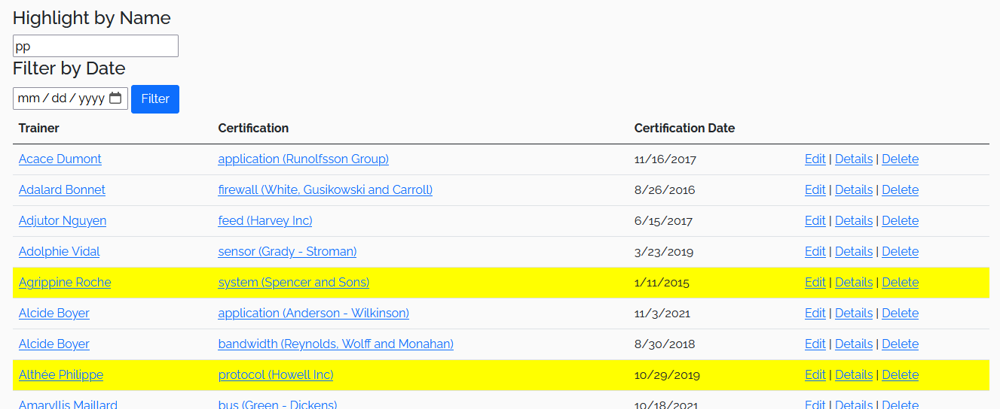
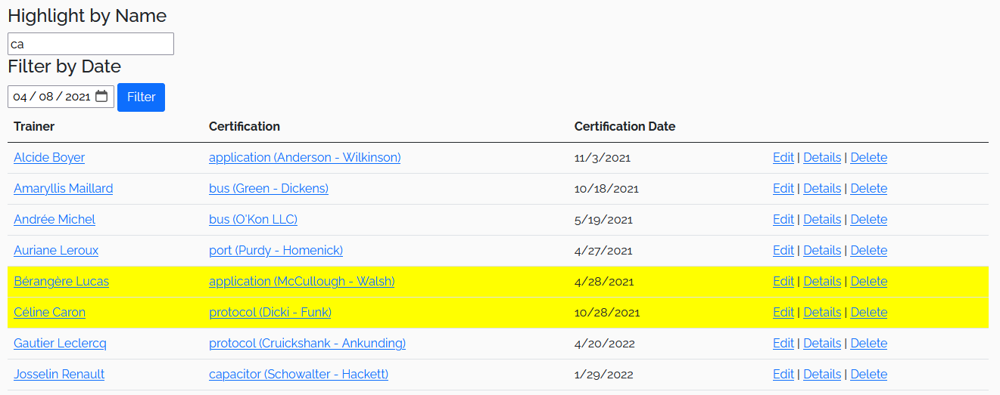

import CommentCommitPush from '/comment-commit-push.mdx';

# TP2

## Consignes
- Lisez toutes les instructions et la grille de correction avant de commencer
- Vous **DEVEZ** faire au moins les migrations et les commits demandés mais vous pouvez en faire plus sans problème, tant que vous les documentez correctement
- Créez un Repository `PRIVÉ`dans GitHub appelé **3W6_TP2_NOM_PRENOM**  et ajoutez votre enseignant comme collaborateur
:::danger
N'oubliez pas de choisir l'option **VisualStudio** pour **.gitignore**
:::
- Créez une branche pour CHAQUE fonctionnalité que vous allez **merge** ou **rebase** selon votre préférence dans la branche MAIN lorsque vous avez terminé la fonctionnalité
- Téléchargez ce de départ[TP2 départ zip](/tps/tp2/TP2-DEPART.zip) qui contient le projet de départ et extraire son contenu dans votre repo de projet.

## Filtre et surlignage des TrainerCertifications

1. Ajoutez le code javascript nécessaire pour surligner les rangées (**\<tr\>**) donc le nom du Trainer contient la string de texte qui est entré dans la boîte de texte.
2. La recherche de texte doit ignorer la case (minuscule ou majuscule)
3. Il y a plusieurs façons possibles de résoudre ce problème, mais c'est une bonne idée d'ajouter un attribut **class** sur le **\<td\>** ou le **\<a\>** qui contient le **nom du trainer** afin de pouvoir facilement les obtenir dans votre code JavaScript.
4. Le surlignage doit se mettre à jour chaque fois que le contenu du champ texte est modifié.

||
|-|

:::info

Vous pouvez simplement utiliser la propriété de style **backgroundColor** pour faire le surlignage

:::

5. Ajoutez le code javascript nécessaire pour filtrer directement sur le client (donc sans faire de requête au serveur), les données en fonction de la date.
6. Il faut seulement afficher les rangées avec une date égale ou supérieure à la date entrer dans le champ date.
7. Le filtrage s'effectue lorsque l'on click sur le bouton "filtrer"
8. Encore une fois, il y a plusieurs façons possibles de résoudre ce problème, mais c'est une bonne idée d'ajouter un attribut class sur le **\<td\>** qui contient le date de la certification pour facilement les obtenir dans votre code JavaScript.

||
|-|

:::info

Pour vous aider avec la comparaison de dates, il est possible de créer un objet de date à partir d'une date en utilisant **new Date(dateString)** et un élément de type input possède la propriété **valueAsDate**

:::

:::warning
Il est possible de filtrer et de surligner en même temps.
:::

## Faites fonctionner le filtre de Trainers

1. Implémentez la fonction **Filter** du **TrainerController** pour retourner une vue Index avec le filtre comme modèle.
2. Implémenter la méthode **GetAllAsync** du service **TrainerService** pour prendre en compte les paramètres de pagination de **TrainerSearchViewModelFilter**
3. Dans la même méthode, il faut également ajouter des **Where** pour filtrer selon chacun des critères de recherche de **TrainerSearchViewModelFilter**
   - Pour le filtre par nom, il faut accepter un résultat si le nom OU le prénom contiennent la chaîne de charactères entrée dans le filtre
4. Pour le SelectList de certification centers, il faut obtenir le **CertificationCenter** (une simple string) de toutes les certifications et enlever les doublons, car il est possible que plusieurs certifications aient le même **CertificationCenter**.
5. Modifiez votre application pour que le filtre s'applique lorsque l’on change n’importe quel paramètre du filtre

:::warning

Cette fois-ci le filtrage est effectué sur le serveur en effectuant une nouvelle requête dans la BD.

:::

:::info

Voici comment faire une requête pour une condition optionnelle dans Linq et ne filtrer que lorsque l'on sélectionne une valeur dans le filtre. 

:::

```csharp

.Where(x=> filter.SelectedCategoryId == null || x.CategoryId == filter.SelectedCategoryId )

```


<CommentCommitPush/>

## Affichez le détail d'un **Trainer** dans la page **Trainer/Index**

1. Écrivez du javascript en utilisant **jQuery** pour ajouter la classe **show** à l’élément enfant **aside** lorsqu'on survole le **card** d’un entraîneur.
2. Écrivez du javascript en utilisant **jQuery** pour retirer la classe **show** à l’élément enfant **aside** lorsqu'on ne survole plus le **card**.

:::info

 Comme **aside** est un enfant de **card**, si l'utilisateur bouge sa souris à l'extérieur de la photo de l'entraîneur vers le **aside**, la souris est toujours techniquement au dessus de **card** et ça ne cause pas d'évênement **onmouseout**. **Ça tombe bien, c'est exactement ce que l'on veut!**

:::

||
|-|

:::danger

 Cette vue de détail (encadrée en rouge) est uniquement en anglais et ce n'est pas un problème pour ce TP. Lorsque vous arriverez à la section sur la traduction, n'oubliez pas que vous n'avez **PAS** à traduire cette page.

:::

<CommentCommitPush/>

## Faire fonctionner la pagination

1. Il faut maintenant utiliser **Items** du modèle **TrainerSearchViewModel** qui est un **IPagniatedList&ltTrainer&gt** pour bien afficher les liens de navigations
2. Mettez le code pour que l’ensemble des pages disponibles soient affichées dans la pagination.
3. Ajoutez la logique que **Previous** et **Next** fonctionnent et s'affichent lorsque nécessaire. 

||
|-|

4. Ajoutez le javascript en utilisant **jQuery** pour que la page change dans le filtre du formulaire et qu'il se soumette automatiquement lorsqu'on clique sur un élément de pagination (incluant Previous et Next). Utilisez les attributs **data-page-id** qui sont déjà là sur les éléments de navigation. Il y a plusieurs façon d'obtenir le même résultat, mais voici les grandes étapes nécesaires en JS :
   - Exécuter une fonction JS lorsqu'un élément de pagnination est cliqué.
   - Obtenir la valeur du **data-page-id** de l'élément sur lequel l'utilisateur a cliqué.
   - Obtenir l'élément qui contient l'information du **SeletectedPageIndex** (libre à vous d'ajouter un Id pour vous aider à l'obtenir plus facilement)
   
   - Modifier la valeur de l'élément en question
5. Une fois que votre navigation fonctionne bien, mettez le **SelectedPageIndex** (l'élément mentionné dans le point précédent) en **type="hidden"** et supprimez le libellé (label associé).

<CommentCommitPush/>

## Générez les vues et contrôleur (RecordController) du modèle Record

:::warning

 Au moment de générez le contrôleur il faut le nommer **RecordController** et non pas **RecordsController** (Donc, pas de s!).
 C'est important car les liens existants et les fichiers de traduction utilisent tous Record et non pas Records!

:::

:::danger

Si vous avez une erreur, assurez-vous d'utiliser la dernière version de toutes les libraries dans votre projet 8.0.X (Présentement 8.0.11, sauf pour la librairie Microsoft.VisualStudio.Web.CodeGeneration.Design qui utilise 8.0.07)

:::

:::warning

La génération de contrôleur utilise parfois des @ dans son code et ça cause des erreurs! Vous pouvez simplement remplacer les @ par un nom de variable différent, comme x.

:::

:::warning

La génération de contrôleur utilisent des **[bind]** pour les actions **post** de **Create** et **Edit**. À moins que vous soyez déjà familié avec leur utilisation, vous pouvez **simplement les retirer**.

:::

1. Générez un contrôleur MVC avec ses vues pour le modèle Record. (Un lien vers cette vue existe déjà dans la barre de navigation)
2. Lorsqu’il y a un dropdown, au lieu de le mettre dans le ViewData ou le ViewBag, faites un ViewModel (**RecordViewModel**) (ou plusieurs) avec les SelectList et les informations du modèle.

:::warning

Il existe déjà des fichiers .resx pour le view model **RecordViewModel**. Si vous utilisez un autre nom ou utiliez d'autres view models, il faudra s'assurer de faire fonctionner la traduction.

:::

3. Lorsque vous affichez **Trainer**:
   - Affichez le **nom complet** du **Trainer**
4. Lorsque vous affichez **Discipline** 
   - Affichez le **nom** de la **Discipline**
5. Faites un **service** pour gérer la création de ViewModel et les interactions avec le DbContext (Une fois que vous avez terminé, le contrôleur n'utilisera plus directement JulieProDBContext)
6. Utilisez le **service** dans le contrôleur 


<CommentCommitPush/>

## Ajoutez une vue pour voir les **Records** d'un **Trainer**
1. Ajoutez une action à votre contrôleur qui permet de voir les **Records** d'un **Trainer** Record/TrainerIndex(int trainerId)
   - Il existe déjà un icône de trophé sur la vue détaillé du Trainer qui doit permettre d'afficher cette page
2. Ajoutez également la vue nécessaire

||
|-|

<CommentCommitPush/>

## Terminez de mettre en place **i18n**
#### Ce qui est déjà fait :
   - Les packages nuget sont installés
   - Les **vues** sont déjà traduites!
   - Les **modèles** aussi!
   - Le Inject du **IViewLocalizer** est aussi déjà présent

#### Ce qu’il faut faire :
   - Il faut configurer **i18n** dans **Program.cs**. Les fichiers de traduction **resx** se trouvent dans le répertoire ** /i18n/ **
   - Il faut ajouter une fonction **SetLanguage** au **HomeController**
   - Il manque le commutateur de langue dans le **_Layout**. Utilisez une vue partielle et nommez-la **_SelectLanguage**
   - Finalement, il faut gérer la culture correctement en ajoutant les librairies nécessaires et en modifiant la vue partielle **_ValidationScriptsPartial**. (VOIR: **Séance 15**) (C'est pas facile de tester cette partie pour l'instant, mais une fois que vous aurez besoin de créer des entrées avec des valeurs décimales, assurez-vous que vous pouvez modifier une entreé avec un nombre avec une décimale en français et en anglais sans problème)

<CommentCommitPush/>

## Vérification de la traduction

1. Assurez-vous que vos **nouvelles** pages sont toutes bien traduites 
   - Il n'est PAS nécessaire de traduire [la vue de détail d'un **Trainer** affichée dans l'index](/tp/tp2#affichez-le-d%C3%A9tail-dun-trainer-dans-la-page-trainerindex)
   - Les resx sont généralement déjà là, utilisez-les
   - Il manque la traduction des messages d’erreur. Assurez-vous de faire la traduction pour les cas suivants:
      - Une valeur de **Amount invalide** (Out of Range)
      - Un champ **Unit manquant** (champ vide)
      - Vous pouvez en faire plus, mais ce ne sera pas évalué. La traduction du message **"must be a number"** est assez complexe, alors ce n'est **pas** conseillé d'essayer de le traduire!
      
   
<CommentCommitPush/>

## Grille de correction

| Tâche | Nb Points |
| :--- | :----: |
| Filtre et surlignage des TrainerCertifications | 5 |
| Faire fonctionner le filtre de Trainer | 5 |
| Afficher le détail d'un Trainer | 1 |
| Faire fonctionner la pagination | 5 |
| Ajouter RecordController | 6 |
| Ajouter une vue pour les records d'un entraîneur | 3 |
| Terminer de mettre en place i18n | 3 |
| Traduire le contenu ajouté | 1 |
| Commits, branches et merge/rebase avec textes pertinents | 1 |
| **Total** | **/30** |
