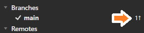
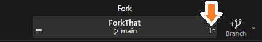
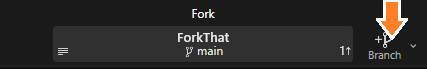
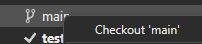
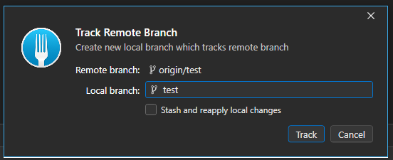

# Fork

## À quoi ça sert?

Définition

Fork permet de cloner et interagir avec un repository Git.

C'est un outil visuel qui permet de remplacer la ligne de commande de Git.

Il permet également de visualiser les différentes branches et commits d'un projet.

## Actions

Ajouter un compte

Cliquez sur File/Accounts...

Cliquez sur le +

Cliquez sur **GitHub** et sur **Login**

Faites l'authentification avec GitHub

Si c'est fonctionnel le compte s'affiche comme ceci

Cloner

Cliquez sur File/Clone...

Il faut:
- Copier l'URL obtenu dans GitHub
- Choisir le répertoire
- Modifier le nom si nécessaire (normalement pas...)

Voir les changements courants

Cliquez sur **Local Changes** pour afficher les changements que vous avez fait.

On peut sélectionner le fichier que l'on veut voir à gauche et voir la différence à droite:

L'option pour ignore les espaces blancs (et changement de ligne) est souvent intéressante

Commit

Tout d'abord, déplacez les fichiers du commit dans la section **Staged**

Cliquez sur le bouton **Stage** pour déplacer le fichier

Vous pouvez également choisir l'option **Stage All** après un **clique droit**

Une fois que les changements sont TOUS dans la section Staged (Sauf si vous voulez ignore certains changements pour l'instant...)

Écrivez un nom et une description pour le commit et cliquez sur le bouton **Commit X File**

Push

Après un commit, on peut voir que l'on a des changements qui ne sont pas encore sur le serveur GitHub.

On le voit à gauche dans le menu de branches:

Et en haut dans le menu central:

Note: On voit le nombre de commits qui n'ont pas encore été poussés sur le serveur (Dans ce cas, il y en a 1)

Appuyez sur le bouton Push

Vérifiez que l'on est dans la bonne branche et cliquez sur Push

Créer une branche

En cliquant sur le bouton + du menu central

Changer de branche

Changez de branche avec un clique droit sur la branche avec laquelle vous voulez travailler

Ou faites simplement un **double clique** sur la branche!

La branche courante a un **crochet devant son nom**.

:::warning
Mais si je ne vois pas ma branche!?
:::

Si c'est le cas, c'est qu'elle existe sur le serveur, mais pas encore **localement**. Pour l'obtenir, il faut faire un "Checkout".

Il y a plusieurs façon de le faire, en voici une.

Commencez par regardez le contenu de Remotes/origin (C'est ce qui est sur GitHub)

Double cliquez sur la branche que vous voulez obtenir localement et cliquez sur Track.

Si tout c'est bien passé, la branche est maintenant sur votre ordinateur (localement) et il y a un crochet à côté (pour montrer que c'est la branche active)

Merger une branche

- Il faut d'abord changer de branche pour être dans la branche où l'on veut merger! Généralement la branche main dans nos projets...
- Ensuite on peut faire un merge de la branche test vers la branche main

Gardez les options par défaut et cliquez sur Merge

Il faut maintenant faire un **Push**

Pull

Lorsque vous travaillez à la maison et que vous voulez obtenir les changements que vous avez fait à l'école, il faut faire un **Pull**!

Avant de faire un pull vous **pouvez** faire un **Fetch**. Le **Fetch** permet de connaître les changements du serveur, sans nécessairement les appliquer localement. On peut voir les changements avec une flèche vers le **BAS** et le nombre de commits sur le serveur qui n'ont pas encore obtenus.

Lorsque vous faites le **Pull**, vous allez obtenir **les changements sur le serveur** dans la **branche** où vous êtes.

Note: Pourquoi on a seulement besoin de le faire à la maison? Par défaut, lorsque l'on fait un clone, Fork va obtenir la version la plus récente d'une branche!

Retirer un changement

Si vous ne voules plus les changements que vous avez fait localement dans un fichier (C'était une erreur)

Faites Discard Changes... et confirmez votre choix

